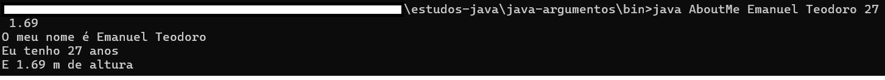
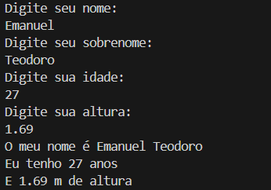

## Argumentos Java

Estudo de aplicações que utilizam argumentos como dados de entrada para realizar tarefas

- **Classe AboutMe**: Primeira classe em que os argumentos devem ser fornecidos em ordem específica no terminal.
Foram realizados testes no Power Shell para sua e execução e no VSCode com a alimentação dos argumentos em "launch.json"
Resultado:

- **Classe AboutMeScanner**: Implementada a classe Scanner para facilitar a entrada dos dados.
Inicialmente, a aplicação solicita o dado desejado através de uma mensagem de texto, e assim, o input é dado pelo usuário.
Resultado:

